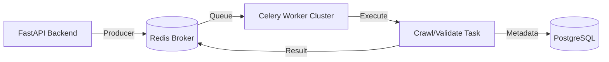

# Celery & Redis Integration Guide

## 1. Executive Summary

PixCrawler utilizes **Celery** as its asynchronous task queue to handle resource-intensive operations such as image crawling, validation, and dataset processing. **Redis** serves as the message broker and result backend. This architecture ensures the FastAPI backend remains responsive by offloading long-running tasks to background workers.

## 2. Architecture

The system follows a standard producer-consumer pattern:



### Components

| Component | Technology | Role |
|-----------|------------|------|
| **Producer** | FastAPI | Enqueues tasks (e.g., `crawl_images_task`) upon user API requests. |
| **Broker** | Redis | Stores task messages in FIFO queues (`celery`). |
| **Consumer** | Celery Worker | Processes that poll Redis for tasks and execute them. |
| **Result Backend** | Redis | Temporarily stores task states (`PENDING`, `SUCCESS`, `FAILURE`) and return values. |

## 3. Configuration

Configuration is centralized in `backend/core/config.py` using Pydantic settings.

### 3.1 Environment Variables
Configure these in your `.env` file:

```bash
# Redis Connection for Broker (Task Queue)
CELERY_BROKER_URL="redis://localhost:6379/1"

# Redis Connection for Results (Task States)
CELERY_RESULT_BACKEND="redis://localhost:6379/1"
```
> [!NOTE]
> We use Redis Database `1` for Celery to avoid key collisions with caching or other services typically on DB `0`.

### 3.2 Key Settings
- **Serialization**: `json` (Enforced for security and compatibility).
- **Timezone**: `UTC`.
- **Task Acks Late**: `True` (Ensures tasks are re-queued if a worker crashes before completion).
- **Worker Concurrency**: Defaults to CPU count involved.

## 4. Operation Guide

### 4.1 Prerequisites
Ensure Redis is running before starting the application:
```bash
redis-server
```

### 4.2 Running Workers (Development)
For local development, especially on **Windows**, use the `solo` pool to avoid multiprocessing issues:

```bash
uv run celery -A backend.celery_core.app worker --loglevel=info --pool=solo
```

### 4.3 Running Workers (Production)
In production (Linux/Docker), use the default prefork pool for better parallelism:

```bash
celery -A backend.celery_core.app worker --loglevel=info --concurrency=4
```

### 4.4 Monitoring
Use **Flower** to visualize the cluster state, queues, and task progress:
```bash
uv run celery -A backend.celery_core.app flower
```
Access the dashboard at `http://localhost:5555`.

## 5. Core Workflows

### Image Crawling Workflow
**Task**: `backend.celery_core.tasks.crawl.crawl_images_task`
1. **Trigger**: POST `/api/v1/jobs/` or `/api/v1/jobs/{id}/retry`.
2. **Process**:
   - Updates Job Status → `PROCESSING`.
   - Distributes sub-tasks for each keyword/search engine chunk.
   - Downloads, validates, and uploads images.
   - Updates Job Progress via `ActivityService`.
3. **Completion**: Updates Job Status → `COMPLETED` or `FAILED`.

### Dataset Validation Workflow
**Task**: `backend.celery_core.tasks.validation.validate_dataset_task`
1. **Trigger**: Manual request or automated hook.
2. **Process**:
   - Scans all images in a dataset.
   - Verifies file integrity, headers, and dimensions.
   - Flags duplicates using perceptual hashing.
   
## 6. Troubleshooting

### Common Errors

> [!WARNING]
> **Windows Users**: If you encounter `ValueError: not enough values to unpack` or `spawn` errors, you **MUST** use the `--pool=solo` flag.

| Symptom | Probable Cause | Solution |
|---------|----------------|----------|
| `ConnectionRefusedError` | Redis is down | Start `redis-server`. |
| Tasks stuck in `PENDING` | No workers active | Start a Celery worker process. |
| `PreconditionFailed` | Serialization Error | Verify `accept_content=['json']` in config. |
| `NameError` in Tasks | Missing Loops/Imports | Check task definition and imports. |

### Verification Steps
To confirm the system is healthy:
1. Start Redis and a Celery Worker (`--pool=solo` on Windows).
2. Start the API.
3. Trigger a simple job (e.g., a "Dry Run" crawl).
4. Watch the Celery terminal for:
   - `[INFO] Task received`
   - `[INFO] Task succeeded`
