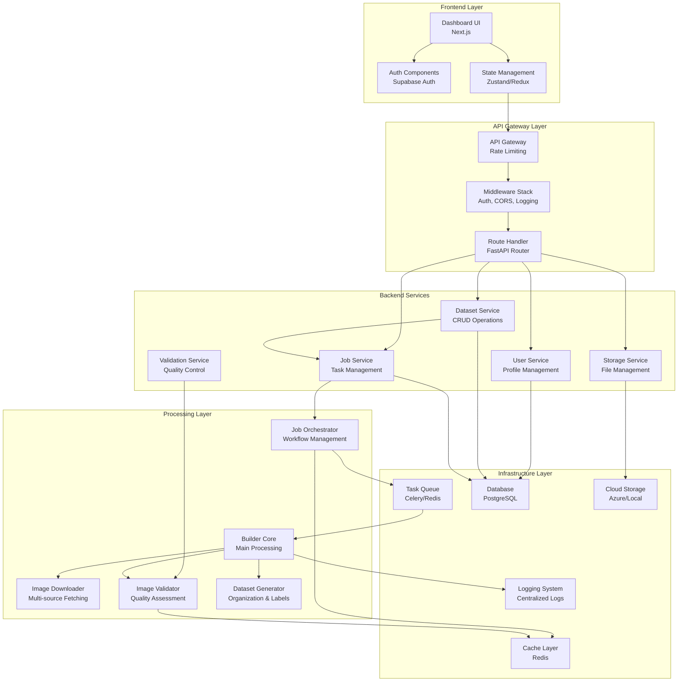
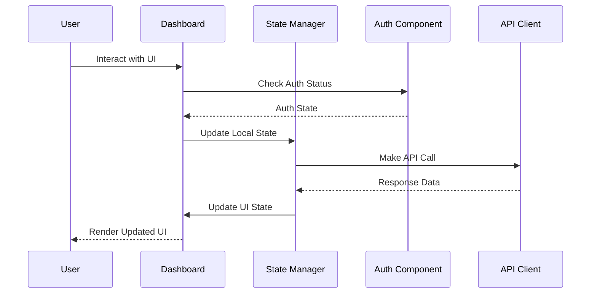
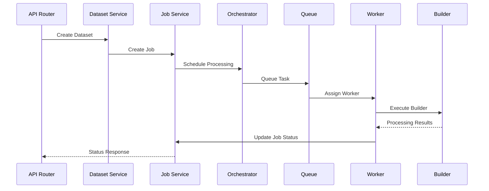
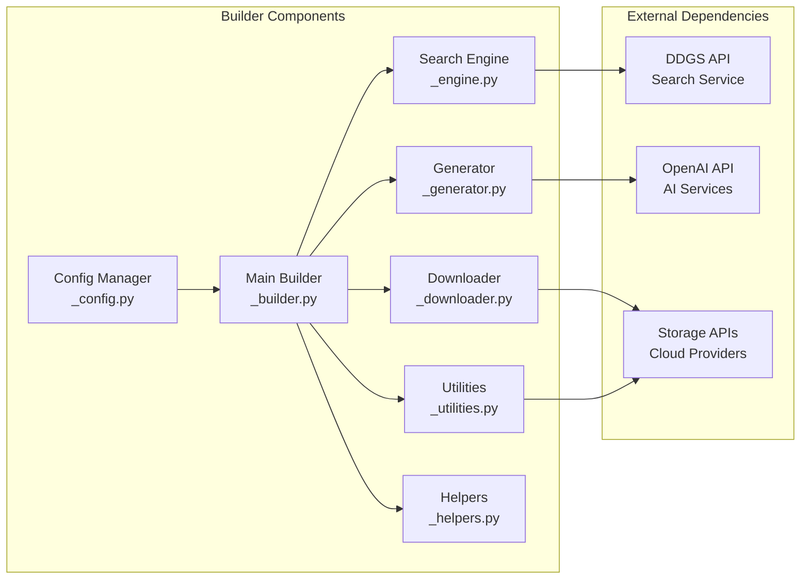
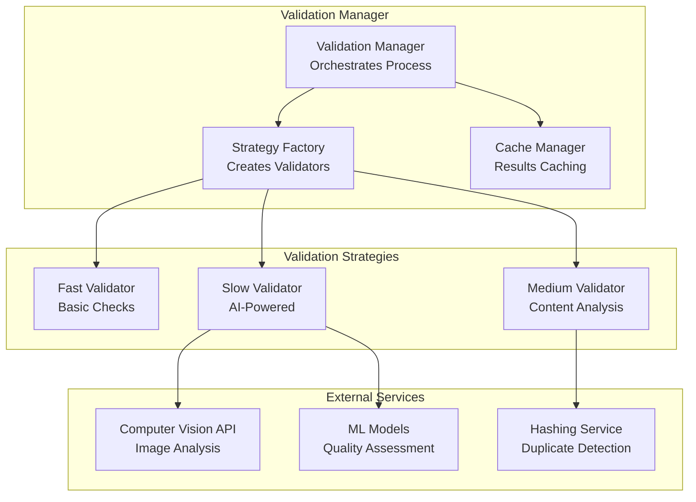
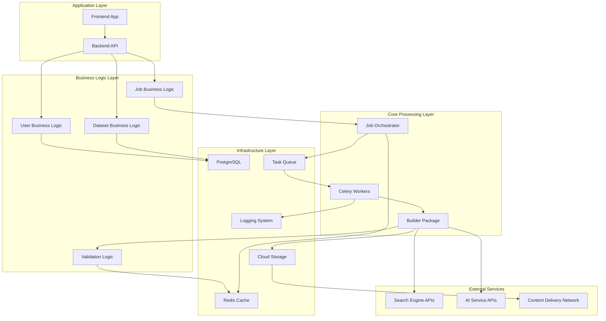
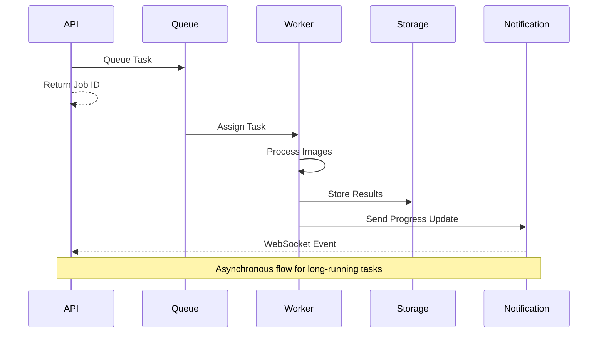

# Component Interaction

## Executive Summary

The PixCrawler system employs a sophisticated multi-layered architecture designed to handle large-scale image dataset creation with high reliability, performance, and maintainability. This document provides a comprehensive analysis of component interactions, data flows, and architectural decisions that enable the platform to process thousands of images efficiently while maintaining data quality and system stability.

## System Architecture Philosophy

PixCrawler follows a **microservices-oriented architecture** with clear separation of concerns across multiple layers. This design philosophy ensures:

- **Scalability**: Individual components can scale independently based on demand
- **Maintainability**: Isolated services reduce complexity and enable focused development
- **Resilience**: Failure in one component doesn't cascade to the entire system
- **Extensibility**: New features and integrations can be added with minimal impact

---

## Component Interaction Overview

The PixCrawler ecosystem consists of five primary architectural layers, each serving distinct functional responsibilities while maintaining loose coupling through well-defined interfaces.

### Layer-by-Layer Analysis

### 1. Frontend Layer

The **Frontend Layer** provides the user interface and client-side logic, built on modern web technologies:

- **Dashboard UI (Next.js)**: Serves as the primary user interface, offering intuitive dataset configuration, job monitoring, and result visualization. The Next.js framework provides server-side rendering capabilities for improved performance and SEO.
- **Auth Components (Supabase Auth)**: Handles user authentication, session management, and authorization flows. Integration with Supabase provides enterprise-grade security with minimal overhead.
- **State Management (Zustand/Redux)**: Manages client-side application state, ensuring consistent data flow and reactive UI updates across components.

### 2. API Gateway Layer

The **API Gateway Layer** acts as the single entry point for all client requests, providing essential cross-cutting concerns:

- **API Gateway**: Implements rate limiting, request routing, and load balancing to protect backend services from overload and ensure fair resource allocation.
- **Middleware Stack**: Provides authentication verification, CORS policy enforcement, request logging, and error handling in a composable pipeline architecture.
- **Route Handler (FastAPI Router)**: Processes incoming requests and routes them to appropriate backend services based on endpoint configuration and business logic.

### 3. Backend Services Layer

The **Backend Services Layer** contains the core business logic organized into focused, domain-specific services:

- **User Service**: Manages user profiles, preferences, and account-related operations with comprehensive data validation and security measures.
- **Dataset Service**: Handles dataset metadata management, configuration validation, and CRUD operations with strong consistency guarantees.
- **Job Service**: Orchestrates dataset creation jobs, managing lifecycle states, progress tracking, and result coordination.
- **Storage Service**: Abstracts file system operations, providing unified access to both hot and warm storage tiers with automatic optimization.
- **Validation Service**: Implements quality control mechanisms for images and datasets, ensuring data integrity and compliance with user requirements.

### 4. Processing Layer

The **Processing Layer** contains the core image processing and dataset generation logic:

- **Job Orchestrator**: Manages complex multi-step workflows, handling dependency resolution, error recovery, and resource allocation across distributed workers.
- **Builder Core**: Coordinates the main dataset building process, integrating multiple specialized components to execute the complete processing pipeline.
- **Image Downloader**: Implements high-performance, fault-tolerant downloading from multiple search engines with intelligent retry mechanisms and rate limiting.
- **Image Validator**: Performs comprehensive image quality assessment using multiple validation strategies (fast, medium, slow) based on processing requirements.
- **Dataset Generator**: Organizes processed images into structured datasets with proper labeling, metadata generation, and format optimization.

### 5. Infrastructure Layer

The **Infrastructure Layer** provides foundational services and data persistence:

- **Task Queue (Celery/Redis)**: Enables asynchronous task processing with reliable job distribution, retry mechanisms, and monitoring capabilities.
- **Cache Layer (Redis)**: Provides high-performance caching for frequently accessed data, session storage, and temporary processing artifacts.
- **Database (PostgreSQL)**: Ensures ACID-compliant data persistence with advanced features like JSON support, full-text search, and replication.
- **Cloud Storage**: Offers scalable object storage with multiple access tiers, enabling cost-effective data management across different usage patterns.
- **Logging System**: Implements centralized, structured logging with search capabilities, enabling comprehensive system monitoring and debugging.

---

## Detailed Component Interactions

### Frontend Component Communication Flow

The frontend follows a unidirectional data flow pattern that ensures predictable state management and optimal user experience.

**Interaction Analysis:**

1. **User Interaction**: All user interactions are captured by the Dashboard UI, which acts as the primary interface controller.
2. **Authentication Check**: Before processing any action, the system verifies user authentication status to ensure secure access.
3. **State Synchronization**: Local state updates are managed centrally, ensuring consistent application state across all components.
4. **API Communication**: The API client handles all server communication with proper error handling and retry logic.
5. **UI Updates**: Reactive state management triggers automatic UI updates, providing immediate feedback to users.

### Backend Service Orchestration Pattern

Backend services implement a choreographed service interaction pattern that promotes loose coupling while ensuring reliable data consistency.

**Service Interaction Principles:**

1. **Request Validation**: The API router validates all incoming requests before forwarding to appropriate services.
2. **Service Coordination**: Each service maintains its own data consistency while coordinating with related services through well-defined contracts.
3. **Asynchronous Processing**: Long-running tasks are offloaded to the queue system, allowing the API to respond immediately with job tracking information.
4. **Progress Tracking**: Job status updates flow back through the service chain, enabling real-time progress monitoring.
5. **Error Propagation**: Failures are captured and propagated back through the service chain with appropriate error context.

---

## Builder Package Architecture

The Builder package represents the core processing engine of PixCrawler, implementing a modular architecture that separates concerns while enabling efficient image processing workflows.

### Component Responsibilities

**Configuration Manager (`_config.py`)**

- Validates dataset configuration against JSON schema
- Manages environment-specific settings and feature flags
- Provides configuration inheritance and override mechanisms
- Ensures type safety and parameter validation

**Main Builder (`_builder.py`)**

- Orchestrates the complete dataset building workflow
- Manages component lifecycle and resource allocation
- Implements progress tracking and error recovery
- Coordinates parallel processing across multiple workers

**Search Engine (`_engine.py`)**

- Abstracts multiple search provider APIs (Google, Bing, DuckDuckGo, Baidu)
- Implements intelligent query generation and keyword expansion
- Manages rate limiting and API quota constraints
- Provides fallback mechanisms for service unavailability

**Downloader (`_downloader.py`)**

- Executes high-performance parallel image downloads
- Implements sophisticated retry logic with exponential backoff
- Manages bandwidth throttling and connection pooling
- Provides integrity verification and corruption detection

**Generator (`_generator.py`)**

- Creates structured dataset hierarchies and metadata
- Generates labels in multiple formats (JSON, CSV, YAML, TXT)
- Implements AI-powered keyword expansion using LLM services
- Provides dataset optimization and compression capabilities

**Utilities (`_utilities.py`)**

- Implements image validation and quality assessment
- Provides duplicate detection using perceptual and content hashing
- Manages file system operations and path handling
- Offers image processing utilities (resize, format conversion)

**Helpers (`_helpers.py`)**

- Contains shared utility functions and common operations
- Provides logging and monitoring instrumentation
- Implements custom exceptions and error handling
- Offers performance profiling and debugging tools

---

## Validation Service Architecture

The Validation Service implements a sophisticated strategy pattern that enables flexible quality control based on performance requirements and accuracy needs.

### Validation Strategy Details

**Fast Validator**

- **Purpose**: Rapid basic quality checks for high-throughput scenarios
- **Checks**: File format validation, size constraints, corruption detection
- **Performance**: ~1000 images/minute on standard hardware
- **Use Cases**: Initial filtering, bulk processing scenarios

**Medium Validator**

- **Purpose**: Balanced approach with content-based analysis
- **Checks**: Duplicate detection via hashing, basic content analysis, metadata validation
- **Performance**: ~100 images/minute with comprehensive checks
- **Use Cases**: Standard dataset creation, quality-conscious workflows

**Slow Validator**

- **Purpose**: Comprehensive AI-powered quality assessment
- **Checks**: NSFW detection, semantic analysis, artistic quality assessment, advanced duplicate detection
- **Performance**: ~10 images/minute with full AI analysis
- **Use Cases**: High-quality datasets, research applications, premium processing

### Validation Manager Orchestration

The Validation Manager implements intelligent strategy selection based on:

- **Dataset Size**: Larger datasets favor faster strategies
- **Quality Requirements**: Higher quality needs trigger more comprehensive validation
- **Time Constraints**: Urgent jobs prioritize speed over thoroughness
- **Cost Considerations**: AI-powered validation incurs higher computational costs

---

## Service Dependencies and Data Flow

### Comprehensive Dependency Graph

The dependency graph illustrates the hierarchical relationships between system components, highlighting critical paths and potential bottlenecks.

### Dependency Analysis

**Critical Path Dependencies:**

1. **Frontend → Backend → Business Logic → Infrastructure**: Core user workflow dependency chain
2. **Job Processing → Queue → Workers → Builder**: Critical processing pipeline
3. **Builder → External APIs**: External service dependencies that could impact availability

**Resilience Patterns:**

- **Circuit Breakers**: Protect against external service failures
- **Bulkheads**: Isolate failures to prevent cascade effects
- **Timeouts**: Prevent resource exhaustion from slow operations
- **Fallbacks**: Provide alternative processing paths when primary services fail

---

## Communication Patterns and Protocols

### Asynchronous Processing Pattern

The system implements sophisticated asynchronous processing to handle long-running tasks while maintaining responsive user interfaces.

### Communication Protocol Details

**HTTP/REST API**

- **Synchronous Operations**: User management, configuration, short queries
- **Response Format**: JSON with consistent error handling
- **Authentication**: JWT tokens with refresh mechanism
- **Rate Limiting**: Per-user and per-endpoint limits to ensure fair usage

**WebSocket Connections**

- **Real-time Updates**: Job progress, status changes, completion notifications
- **Connection Management**: Automatic reconnection with exponential backoff
- **Message Queuing**: Guaranteed delivery for critical updates

**Message Queue Protocol**

- **Task Distribution**: Celery protocol over Redis transport
- **Priority Queues**: Different priority levels for urgent vs. batch processing
- **Dead Letter Queues**: Failed task handling with manual intervention capabilities

**Database Access Patterns**

- **Connection Pooling**: Efficient database connection management
- **Read Replicas**: Separated read/write operations for scalability
- **Transaction Management**: ACID compliance for critical operations