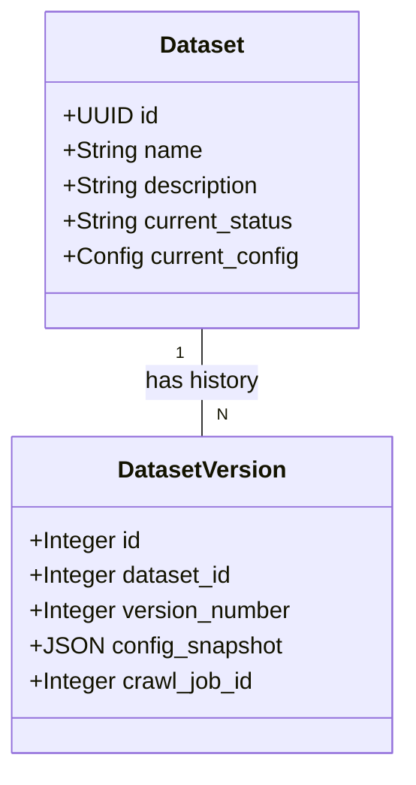

# Dataset Versioning System

## 1. Overview

The **Dataset Versioning System** ensures data integrity and reproducibility in PixCrawler. It treats dataset configurations as immutable snapshots, allowing users to experiment with different parameters (e.g., keywords, search engines) without losing the history of previous data collection runs.

## 2. Architecture

### 2.1 Data Model
The system creates a clear separation between the *Current State* and *Historical State*.



- **Dataset**: Holds mutable metadata (Name, Description) and pointers to the current state.
- **DatasetVersion**: An immutable record of a specific configuration state and its associated crawl results.

### 2.2 Versioning Logic

| update Type | Trigger condition | System Action |
|-------------|-------------------|---------------|
| **Metadata Update** | `name`, `description` changed | Updates `Dataset` table directly. No new version created. |
| **Config Update** | `keywords`, `search_engines`, `max_images` changed | 1. Creates new `DatasetVersion` (vNext).<br>2. Archives previous active job.<br>3. Starts new `CrawlJob` for vNext. |
| **Rollback** | User requests restore of v(X) | 1. Fetches config from v(X).<br>2. Treats it as a new "Config Update".<br>3. Creates v(Latest+1) with v(X)'s config. |

> [!NOTE]
> **Rollback is Forward-Moving**: We never delete history. Rolling back to v1 creates a new v4 that *looks* like v1. This preserves the complete lineage of actions.

## 3. Frontend Workflow

### Version History Interface
Located in **Dashboard > Datasets > [Dataset] > History**:
- **Timeline View**: Lists all versions in reverse chronological order.
- **Change Log**: Highlights what changed in each version (e.g., `+ Added keyword "tiger"`).
- **Actions**:
  - `View Snapshot`: See the exact config of that version.
  - `Rollback`: Restore that version's configuration.

### Rollback Process
1. User clicks **"Rollback"** on the v1 card.
2. System prompts for confirmation.
3. Upon confirmation, the page refreshes.
4. Top of the list shows **v4 (Restored from v1)** with status `PENDING`.

## 4. API Reference

### Endpoints

| Endpoint | Method | Description |
|----------|--------|-------------|
| `/api/v1/datasets/{id}/versions` | `GET` | Retrieve specific version history list. |
| `/api/v1/datasets/{id}/versions/{v_num}` | `GET` | Retrieve details for a specific version number. |
| `/api/v1/datasets/{id}/rollback` | `POST` | Create a new version based on a historical one. |

### Rollback Payload
```json
// POST /api/v1/datasets/{id}/rollback
{
  "version_number": 1
}
```

## 5. Implementation Guide

### 5.1 Prerequisites
The `dataset_versions` table must exist in your database.

**Manual Migration Check**:
If the table is missing, run the Alembic migration:
```bash
uv run alembic upgrade head
```

### 5.2 Validation
To verify the system logic, run the dedicated test suite:
```bash
uv run pytest backend/tests/services/test_dataset_versioning.py
```
*Ensure your `.env` is configured with a valid `SUPABASE_ANON_KEY` and `DATABASE_URL` for tests to run.*

## 6. Troubleshooting

**Issue: Versions are not being created on update.**
- **Cause**: The system might view the update as a "Metadata Only" change.
- **Fix**: Verify that you are actually changing `keywords`, `search_engines`, or `max_images` in your update request.

**Issue: Rollback fails with "Active Job" error.**
- **Cause**: The current version has a `RUNNING` job that couldn't be cancelled.
- **Fix**: Manually cancel the job via the Jobs API/UI, then try the rollback again.
