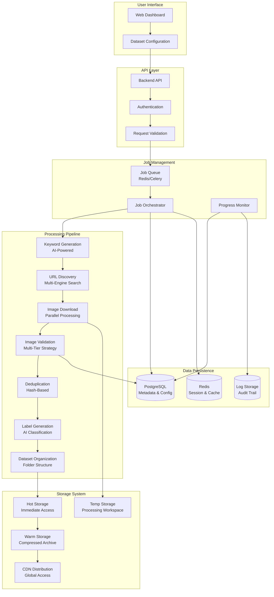
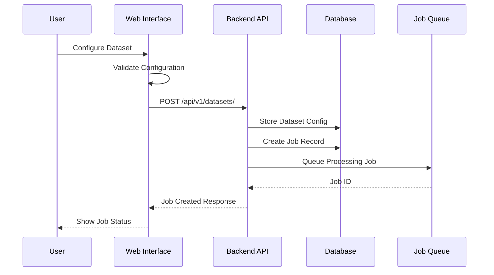
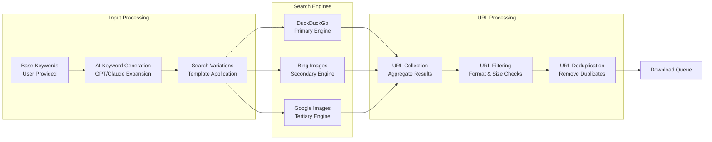
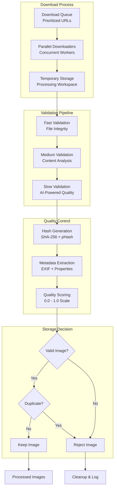
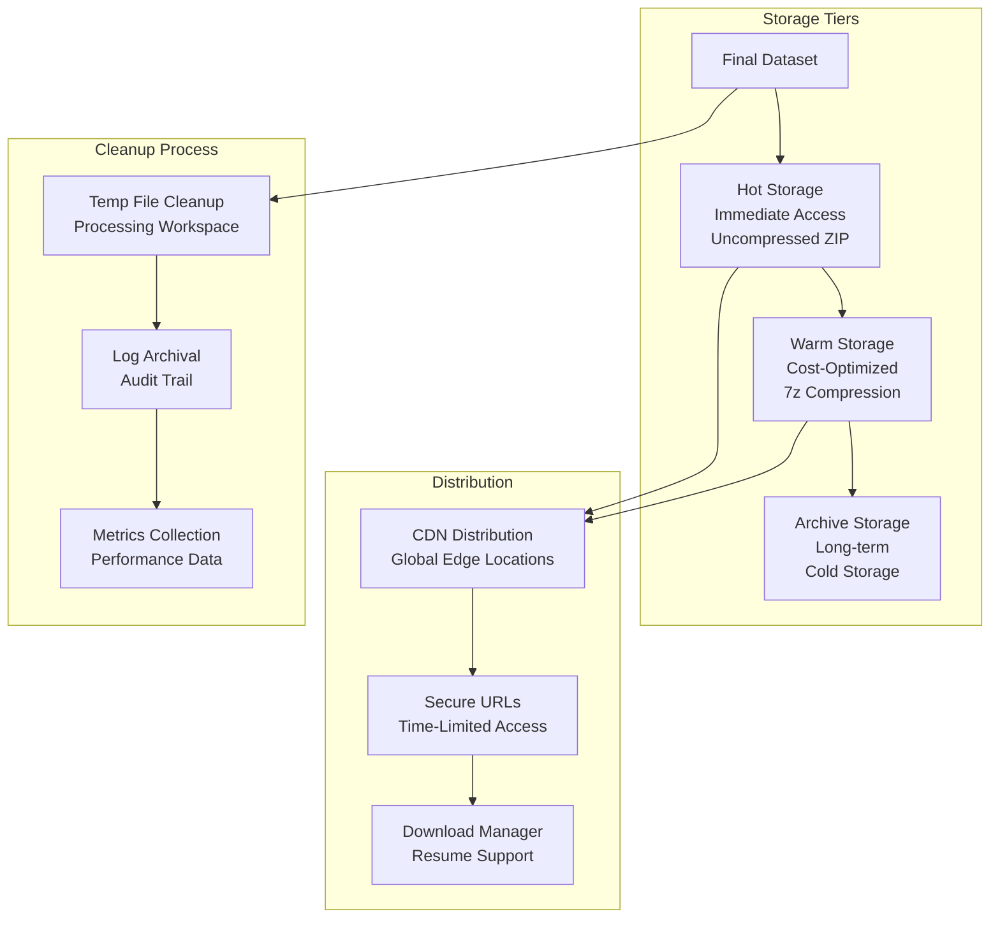

# Data Flow

## Overview

This document illustrates the complete data flow through the PixCrawler system, from user input to final dataset delivery. The flow encompasses multiple processing stages with validation, transformation, and storage operations.

## High-Level Data Flow

The high-level data flow diagram provides an overview of the end-to-end pipeline in PixCrawler, organized into logical subgraphs: User Interface (input collection), API Layer (request handling), Job Management (orchestration), Processing Pipeline (core transformations), Storage System (tiered persistence), and Data Persistence (metadata tracking). Arrows depict the sequential progression of data, from configuration to distribution, with branches for monitoring, logging, and storage decisions. This structure underscores the system's modularity, allowing for parallel processing and efficient resource management across stages.

## Detailed Processing Pipeline

### Phase 1: Configuration & Job Creation

This sequence diagram details the initial phase where users configure and initiate a dataset job. It traces interactions from the user through the web interface to the backend API, database storage, and job queuing. Key steps include configuration validation, job record creation, and asynchronous queuing, ensuring immediate feedback to the user via job status responses. This phase sets the foundation for scalable, trackable processing.

### Phase 2: Keyword Generation & URL Discovery

The flowchart for Phase 2 illustrates the expansion and search process for gathering image URLs. It begins with user-provided keywords, enhanced by AI generation and variations, then branches to multiple search engines for diverse results. Subsequent aggregation, filtering, and deduplication ensure a clean queue for downloads. This phase emphasizes redundancy across engines to maximize coverage and quality of discovered content.

### Phase 3: Image Download & Validation

This flowchart outlines the download and multi-tier validation in Phase 3, showing parallel downloading into temporary storage followed by sequential validation gates (fast, medium, slow). Quality controls like hashing, metadata extraction, and scoring feed into decision diamonds for acceptance or rejection. Rejected items trigger cleanup, while valid ones proceed, highlighting the system's efficiency in handling high-volume, error-prone downloads.

### Phase 4: Dataset Organization & Labeling

The Phase 4 flowchart depicts the transformation of processed images into a structured dataset. It flows from categorization into hierarchical folders, through AI-driven labeling with confidence checks, to generating multiple format outputs and assembly artifacts like manifests and reports. This phase ensures the dataset is not only organized but also enriched with metadata for downstream usability in machine learning workflows.

```mermaid
flowchart LR
    subgraph "Organization Process"
        PROCESSED[Processed Images]
        CATEGORIZE[Categorization<br/>Keyword-Based Folders]
        STRUCTURE[Directory Structure<br/>Hierarchical Layout]
    end

    subgraph "Labeling System"
        AI_LABEL[AI Labeling<br/>Computer Vision]
        CONFIDENCE[Confidence Scoring<br/>Label Reliability]
        FORMATS[Multiple Formats<br/>JSON, CSV, YAML, TXT]
    end

    subgraph "Final Assembly"
        MANIFEST[Dataset Manifest<br/>Complete File List]
        METADATA_FILE[Metadata Files<br/>Statistics & Info]
        VALIDATION_REPORT[Validation Report<br/>Quality Analysis]
    end

    PROCESSED --> CATEGORIZE
    CATEGORIZE --> STRUCTURE
    STRUCTURE --> AI_LABEL

    AI_LABEL --> CONFIDENCE
    CONFIDENCE --> FORMATS

    FORMATS --> MANIFEST
    MANIFEST --> METADATA_FILE
    METADATA_FILE --> VALIDATION_REPORT

    VALIDATION_REPORT --> FINAL[Final Dataset]

```

### Phase 5: Storage & Distribution

This final flowchart illustrates the tiered storage progression and distribution mechanisms in Phase 5. From the assembled dataset, data moves through hot, warm, and archive tiers, with CDN integration for secure, resumable downloads. Parallel cleanup and metrics collection ensure resource efficiency and auditability, completing the pipeline with optimized accessibility and cost management.

