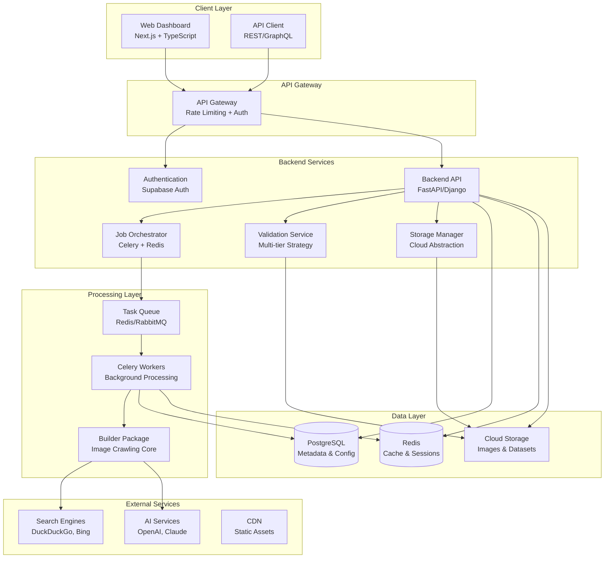
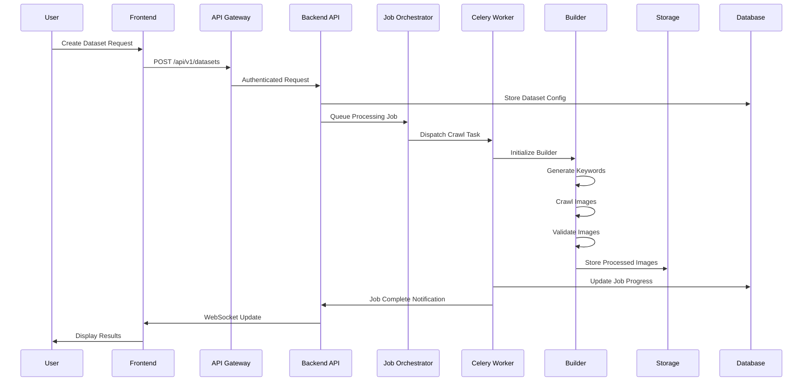
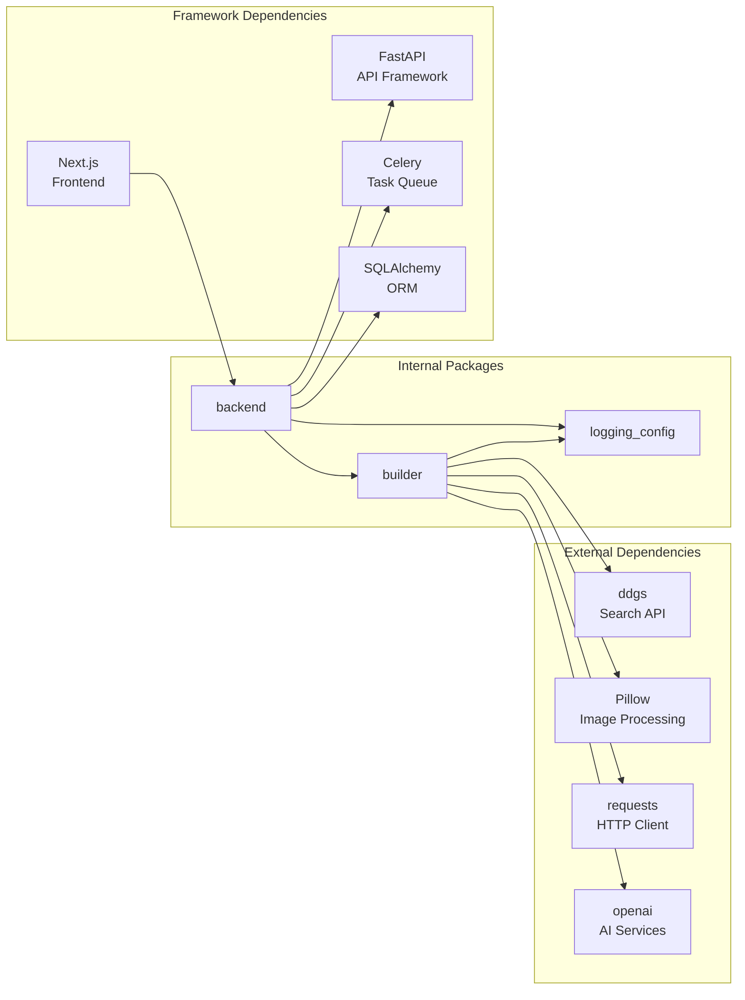
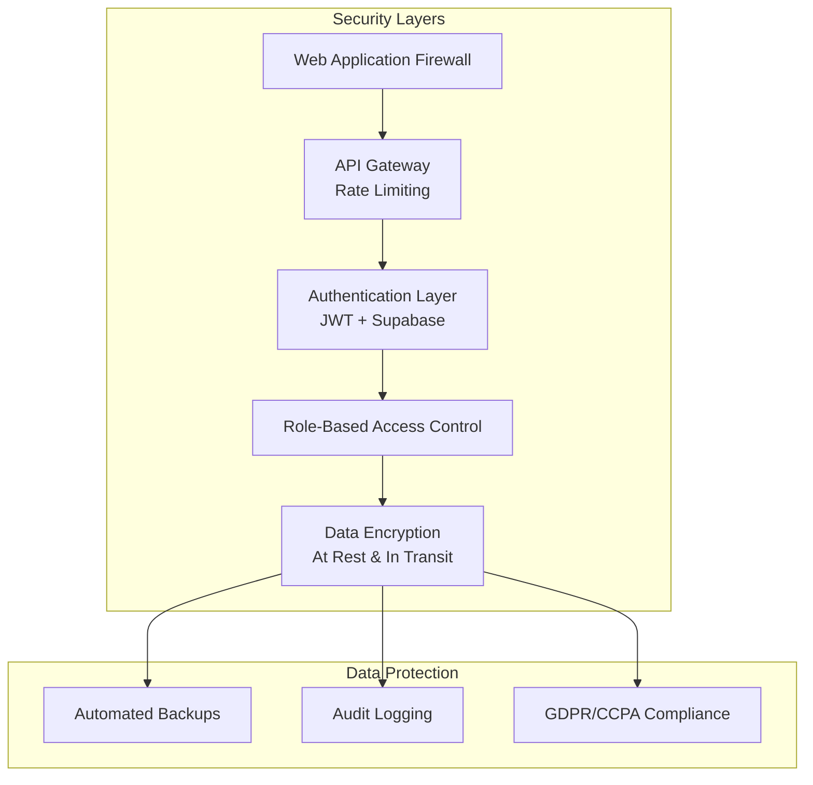

# System Architecture

# System Architecture

## Overview

PixCrawler is a monorepo-based SaaS platform for automated image dataset creation. The architecture follows a microservices pattern with clear separation of concerns across frontend, backend, and builder packages.

## High-Level Architecture

The high-level architecture diagram illustrates the layered structure of PixCrawler, from the client-facing components to external integrations. It highlights the flow of data and requests through various subgraphs: Client Layer (user interfaces), API Gateway (entry point with security), Backend Services (core logic and orchestration), Processing Layer (background tasks and crawling), Data Layer (persistent storage), and External Services (third-party dependencies). Arrows represent directional dependencies and communication paths, such as API calls, task queuing, and data storage operations. This design ensures scalability by isolating concerns and enabling independent scaling of services.

## Monorepo Structure

This diagram depicts the hierarchical organization of the PixCrawler monorepo, starting from the root directory. It breaks down the key packages—frontend, backend, builder, logging_config, docs, and tests—into their subcomponents. For instance, the frontend includes app routes, utility libraries, and UI components; the backend covers API endpoints, data models, business services, and task definitions; and the builder focuses on core modules like downloading, generation, and utilities. This structure promotes code reuse, centralized management, and easier maintenance across the entire codebase.

```mermaid
graph TD
    ROOT[PixCrawler Root]

    ROOT --> FRONTEND[frontend/<br/>Next.js Application]
    ROOT --> BACKEND[backend/<br/>API Services]
    ROOT --> BUILDER[builder/<br/>Core Processing]
    ROOT --> LOGGING[logging_config/<br/>Centralized Logging]
    ROOT --> DOCS[docs/<br/>Documentation]
    ROOT --> TESTS[tests/<br/>Integration Tests]

    FRONTEND --> F_APP[app/<br/>Pages & Routes]
    FRONTEND --> F_LIB[lib/<br/>Utilities & DB]
    FRONTEND --> F_COMP[components/<br/>UI Components]

    BACKEND --> B_API[api/<br/>REST Endpoints]
    BACKEND --> B_MODELS[models/<br/>Data Models]
    BACKEND --> B_SERVICES[services/<br/>Business Logic]
    BACKEND --> B_TASKS[tasks/<br/>Celery Tasks]

    BUILDER --> B_CORE[_builder.py<br/>Main Interface]
    BUILDER --> B_DOWN[_downloader.py<br/>Image Fetching]
    BUILDER --> B_GEN[_generator.py<br/>Dataset Creation]
    BUILDER --> B_UTIL[_utilities.py<br/>Validation & Utils]
    BUILDER --> B_ENG[_engine.py<br/>Search Engines]

    LOGGING --> L_MGR[manager.py<br/>Logger Manager]
    LOGGING --> L_CONF[config.py<br/>Environment Config]
    LOGGING --> L_HAND[handlers.py<br/>Custom Handlers]

```

## Component Interaction Flow

The sequence diagram outlines the end-to-end workflow for creating a dataset in PixCrawler. It shows interactions between the user, frontend, gateway, backend API, job orchestrator, workers, builder, storage, and database. The process begins with a user request, flows through authentication and queuing, executes asynchronous crawling and validation in the builder, and concludes with real-time updates via WebSockets. This flow emphasizes the system's ability to handle long-running tasks without blocking the user interface.

## Package Dependencies

This dependency graph categorizes relationships into External Dependencies (third-party libraries like search APIs and AI services), Internal Packages (core modules like builder and backend), and Framework Dependencies (tools like FastAPI and Celery). Arrows indicate import or usage flows, such as the builder relying on external search tools and logging, while the backend integrates with the builder for processing tasks. This visualization helps identify potential bottlenecks, circular dependencies, and areas for refactoring.

## Service Communication Patterns

### Synchronous Communication

- **Frontend ↔︎ Backend API**: REST API calls for CRUD operations
- **Backend ↔︎ Database**: Direct SQL queries via ORM
- **Backend ↔︎ Storage**: Cloud storage API calls

### Asynchronous Communication

- **Backend → Job Queue**: Task dispatch via Celery
- **Workers ↔︎ Builder**: Function calls within worker processes
- **Workers → Database**: Progress updates and result storage

### Event-Driven Communication

- **Job Status Updates**: WebSocket connections for real-time updates
- **Progress Notifications**: Server-sent events for long-running tasks
- **Error Handling**: Event-based error propagation and recovery

## Scalability Considerations

### Horizontal Scaling

- **API Servers**: Load-balanced FastAPI instances
- **Celery Workers**: Auto-scaling worker pools
- **Database**: Read replicas for query distribution
- **Storage**: CDN integration for global distribution

### Vertical Scaling

- **GPU Workers**: Specialized workers for AI validation tasks
- **Memory Optimization**: Streaming processing for large datasets
- **CPU Optimization**: Multi-threaded image processing

### Caching Strategy

- **Redis Cache**: Session data, API responses, validation results
- **CDN Cache**: Static assets, processed images
- **Application Cache**: Configuration data, user preferences

## Security Architecture

The security architecture diagram layers protective measures from perimeter defenses (like WAF) to data protection (backups and compliance). It flows sequentially from external threats through authentication, access control, and encryption, ensuring comprehensive coverage. The Data Protection subgraph ties into encryption for ongoing safeguards, emphasizing a defense-in-depth approach to mitigate risks like unauthorized access and data breaches.

## Environment Configurations

### Development Environment

- **Storage**: Local filesystem simulation
- **Queue**: Local Redis instance
- **Database**: Local PostgreSQL
- **Validation**: Fast validation only
- **Logging**: Console output with colors

### Production Environment

- **Storage**: Azure Blob Storage + CDN
- **Queue**: Redis Cluster
- **Database**: PostgreSQL with read replicas
- **Validation**: Multi-tier validation strategies
- **Logging**: Structured JSON logs with aggregation

## Monitoring & Observability

### Application Metrics

- **Request Latency**: API response times
- **Job Throughput**: Images processed per minute
- **Error Rates**: Failed requests and tasks
- **Resource Usage**: CPU, memory, storage utilization

### Business Metrics

- **User Activity**: Active users, dataset creation rates
- **Quality Metrics**: Validation success rates, duplicate detection
- **Cost Metrics**: Storage usage, processing costs
- **Performance Metrics**: Job completion times, user satisfaction

### Alerting Strategy

- **Critical Alerts**: Service outages, data corruption
- **Warning Alerts**: High error rates, resource exhaustion
- **Info Alerts**: Deployment notifications, maintenance windows