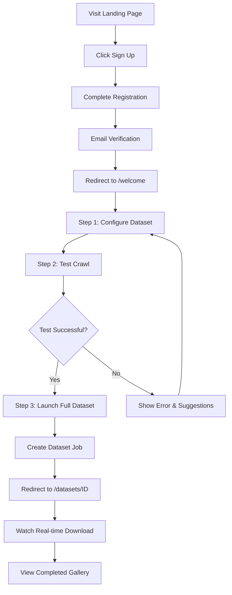

# PixCrawler Frontend Architecture Plan

## 🗺️ Route Structure

```
/                           → Landing Page (Public)
/sign-in                    → Sign In Page (Public)
/sign-up                    → Sign Up Page (Public)
/welcome                    → First-Time Onboarding (Protected - One-time)
/home                       → Home Dashboard (Protected)
/datasets                   → Datasets List (Protected)
/datasets/new               → Create Dataset (Protected)
/datasets/[id]              → Dataset Detail & Gallery (Protected)
/profile                    → User Profile & Settings (Protected)

```

---

## 📄 Page Components & Content

### 1. **Landing Page** (`/`)

*Similar to Resend's clean, modern design*

### Components:

```
LandingPage/
├── Navigation
│   ├── Logo
│   ├── NavLinks (Features, Pricing, Docs)
│   └── AuthButtons (Sign In, Sign Up)
├── HeroSection
│   ├── Headline (e.g., "Build ML Datasets in Minutes")
│   ├── Subheadline
│   ├── CTAButtons (Get Started, View Demo)
│   └── HeroVisual (Animated dataset preview or code snippet)
├── FeaturesSection
│   ├── FeatureCard (Intelligent Crawling)
│   ├── FeatureCard (Smart Validation)
│   ├── FeatureCard (Auto Organization)
│   └── FeatureCard (AI-Powered Keywords)
├── HowItWorksSection
│   ├── Step (Configure)
│   ├── Step (Process)
│   └── Step (Download)
├── UseCasesSection
│   ├── UseCaseCard (Research & Academia)
│   ├── UseCaseCard (Enterprise)
│   └── UseCaseCard (Individual Developers)
├── TrustedBySection
│   └── LogoCloud (partner/user logos)
└── Footer
    ├── FooterLinks (Product, Company, Resources)
    └── Social Icons

```

**Design Notes:**

- Clean, minimal design with bold typography
- Gradient backgrounds and glassmorphism effects
- Smooth scroll animations
- Dark mode by default with light mode toggle

---

### 2. **Sign In Page** (`/sign-in`)

### Components:

```
SignInPage/
├── AuthLayout
│   ├── BrandSide (Left panel with visuals)
│   └── FormSide (Right panel)
└── SignInForm
    ├── EmailInput
    ├── PasswordInput
    ├── RememberMeCheckbox
    ├── ForgotPasswordLink
    ├── SignInButton
    ├── DividerWithOr
    ├── SocialAuthButtons (Google, GitHub)
    └── SignUpPrompt (Link to /sign-up)

```

**Features:**

- Supabase Auth integration
- Email/password and OAuth (Google, GitHub)
- Form validation with error states
- Redirect to `/home` after successful login (existing users)

---

### 3. **Sign Up Page** (`/sign-up`)

### Components:

```
SignUpPage/
├── AuthLayout
└── SignUpForm
    ├── FullNameInput
    ├── EmailInput
    ├── PasswordInput
    ├── PasswordStrengthIndicator
    ├── TermsCheckbox
    ├── SignUpButton
    ├── DividerWithOr
    ├── SocialAuthButtons
    └── SignInPrompt (Link to /sign-in)

```

**Features:**

- Real-time password strength validation
- Email verification flow
- **NEW:** Redirect to `/welcome` for first-time users (Resend-style onboarding)
- Redirect to `/home` for returning users

---

### 4. **Welcome Page** (`/welcome`) ⭐ NEW - Resend-Inspired

*First-time user onboarding - Shows only once after registration*

### Components:

```
WelcomePage/
├── OnboardingLayout (Full-screen, centered)
│   ├── ProgressIndicator (Step 1/3, 2/3, 3/3)
│   └── SkipButton (Optional - "Skip to Dashboard")
└── OnboardingSteps
    ├── Step1: ConfigureFirstDataset
    │   ├── WelcomeMessage
    │   │   ├── Greeting ("Welcome to PixCrawler, {UserName}!")
    │   │   └── Tagline ("Create your first dataset in 3 simple steps")
    │   ├── ConfigurationForm
    │   │   ├── DatasetNameInput
    │   │   │   └── Example ("my_first_dataset")
    │   │   ├── CategoryInput
    │   │   │   └── Placeholder ("cats, dogs, birds")
    │   │   └── ImageCountSlider (Default: 100)
    │   ├── CodePreview (Live JSON preview)
    │   │   └── SyntaxHighlightedJSON
    │   └── NextButton ("Configure Dataset →")
    │
    ├── Step2: TestConfiguration
    │   ├── InstructionCard
    │   │   ├── Icon (🧪)
    │   │   ├── Title ("Test Your Configuration")
    │   │   └── Description ("We'll do a quick test with 10 images")
    │   ├── TestButton ("Run Test Crawl")
    │   ├── TestResultsPanel (After clicking test)
    │   │   ├── LoadingSpinner (During test)
    │   │   ├── SuccessMessage
    │   │   │   ├── CheckIcon ✓
    │   │   │   ├── Message ("Found 10 images successfully!")
    │   │   │   └── PreviewThumbnails (3-4 sample images)
    │   │   └── ErrorMessage (if test fails)
    │   │       ├── ErrorIcon ⚠️
    │   │       └── FixSuggestions
    │   └── NextButton ("Looks Good! →") (Enabled after successful test)
    │
    └── Step3: LaunchFullDataset
        ├── SummaryCard
        │   ├── Icon (🚀)
        │   ├── Title ("Ready to Launch!")
        │   ├── ConfigSummary
        │   │   ├── DatasetName
        │   │   ├── Categories
        │   │   ├── ImageCount
        │   │   └── EstimatedTime ("~5 minutes")
        │   └── CostEstimate ("~$0.50" or "Free tier")
        ├── ActionButtons
        │   ├── LaunchButton ("Create Full Dataset 🎉")
        │   │   └── OnClick → Create job → Navigate to /datasets/[id]
        │   └── BackButton ("← Adjust Settings")
        └── HelpCard
            ├── Icon (💡)
            ├── Title ("What happens next?")
            └── BulletPoints
                ├── "Images will download in real-time"
                ├── "You can monitor progress live"
                └── "Get notified when complete"

```

### Features & Behavior:

**Step 1: Configure First Dataset**

- Pre-filled with sensible defaults for quick start
- Live JSON preview updates as user types
- Simple, focused form (only 3 fields)
- Clean, spacious layout with clear typography
- Progress indicator at top shows "1 of 3"

**Step 2: Test Configuration**

- Single CTA button: "Run Test Crawl"
- Executes lightweight test job (10 images max)
- Shows real-time loading state with smooth animation
- On success:
  - Displays success message with checkmark
  - Shows 3-4 thumbnail previews of found images
  - Enables "Next" button
- On failure:
  - Shows friendly error message
  - Suggests fixes (e.g., "Try different keywords")
  - Allows retry without leaving page

**Step 3: Launch Full Dataset**

- Clean summary card with all configuration details
- Visual hierarchy emphasizing the "Launch" CTA
- Estimated time and cost transparency
- "What happens next?" section sets expectations
- Primary action creates real dataset job
- Immediately redirects to live monitoring view

### Design Philosophy (Resend-Style):

1. **Progressive Disclosure**: Each step reveals only what's needed
2. **Immediate Feedback**: Actions provide instant visual confirmation
3. **Safe Experimentation**: Test step lets users validate before committing
4. **Clear Navigation**: Always know where you are (1/3, 2/3, 3/3)
5. **Skip Option**: Power users can skip to dashboard
6. **One-time Experience**: Never shown again (tracked in user metadata)

### Technical Implementation:

```tsx
// Database schema addition
User
{
...
  onboarding_completed: boolean(
default:
  false
)
  onboarding_completed_at: timestamp(nullable)
}

// Routing logic
useEffect(() => {
  if (user && !user.onboarding_completed) {
    router.push('/welcome')
  }
}, [user])

// After completing Step 3
async function completeOnboarding() {
  await updateUser({
    onboarding_completed: true,
    onboarding_completed_at: new Date()
  })
  router.push(`/datasets/${createdDatasetId}`)
}

```

---

### 5. **Home Dashboard** (`/home`)

*Default landing page for returning users*

### Components:

```
HomePage/
├── DashboardLayout
│   ├── Sidebar
│   │   ├── Logo
│   │   ├── NavItems (Home, Datasets, Profile)
│   │   └── UserMenu
│   └── MainContent
└── DashboardOverview
    ├── WelcomeBackBanner
    │   ├── GreetingMessage ("Welcome back, {Name}!")
    │   └── QuickCreateButton ("+ New Dataset")
    ├── StatsGrid
    │   ├── StatCard (Total Datasets)
    │   │   ├── Icon
    │   │   ├── Value (12)
    │   │   └── Trend ("+3 this week")
    │   ├── StatCard (Images Processed)
    │   │   └── Value (45,234)
    │   ├── StatCard (Storage Used)
    │   │   └── ProgressBar (4.2 GB / 10 GB)
    │   └── StatCard (Active Jobs)
    │       └── Value (2 running)
    ├── RecentDatasets
    │   ├── SectionHeader ("Recent Datasets")
    │   └── DatasetCard[] (Last 5 datasets)
    │       ├── ThumbnailGrid (4 images)
    │       ├── DatasetName
    │       ├── StatusBadge
    │       └── QuickActions (View, Download)
    ├── ActiveJobsWidget (If any jobs running)
    │   ├── SectionHeader ("Active Jobs")
    │   └── JobProgressCard[]
    │       ├── DatasetName
    │       ├── ProgressBar
    │       ├── CurrentStage ("Downloading...")
    │       └── QuickActions (View, Pause, Cancel)
    └── ActivityFeed
        ├── SectionHeader ("Recent Activity")
        └── ActivityItem[]
            ├── Icon
            ├── Description ("Dataset 'cats_dogs' completed")
            └── Timestamp ("2 hours ago")

```

**Features:**

- Clean dashboard with key metrics
- Quick access to recent work
- Real-time active job monitoring
- Prominent "Create Dataset" CTA
- Activity timeline for transparency

---

### 6. **Create Dataset Page** (`/datasets/new`)

### Components:

```
CreateDatasetPage/
├── DashboardLayout
└── DatasetWizard
    ├── ProgressIndicator (Step 1/3, 2/3, 3/3)
    ├── Step1: BasicInfo
    │   ├── DatasetNameInput
    │   ├── DescriptionTextarea
    │   └── CategoriesInput (Multi-input with chips)
    ├── Step2: Configuration
    │   ├── ImagesPerCategorySlider
    │   ├── SearchEngineSelector (checkboxes)
    │   ├── QualityFiltersSection
    │   │   ├── MinResolutionInputs (width x height)
    │   │   └── FormatSelector (jpg, png, webp)
    │   └── ValidationStrategySelect (Fast/Medium/Slow)
    ├── Step3: Review
    │   ├── ConfigurationSummary
    │   └── EstimatedMetrics (Time, Storage, Cost)
    └── WizardActions
        ├── BackButton
        ├── NextButton
        └── CreateButton (Final step)

```

**Features:**

- Multi-step wizard with validation
- Real-time cost/time estimation
- JSON schema validation
- On submit → Create job → Navigate to `/datasets/[id]` with live updates

---

### 7. **Dataset Detail & Gallery Page** (`/datasets/[id]`)

*Real-time download monitoring + Gallery view*

### Components:

```
DatasetDetailPage/
├── DashboardLayout
└── DatasetView
    ├── StatusSection (Conditional on job status)
    │   ├── ProcessingIndicator
    │   │   ├── LiveProgressBar
    │   │   ├── CurrentStage (Discovery, Download, Validation...)
    │   │   ├── ImageCounter (Downloaded: 45/1000)
    │   │   └── ETADisplay
    │   ├── ActionButtons
    │   │   ├── PauseButton
    │   │   └── CancelButton (Delete job)
    │   └── RealtimeImageStream
    │       └── ImageThumbnail[] (Live grid of downloading images)
    ├── CompletedView (When status = completed)
    │   ├── DatasetHeader
    │   │   ├── DatasetName
    │   │   ├── Statistics (Total images, categories, size)
    │   │   └── DownloadButton (Hot/Warm storage)
    │   ├── FilterBar
    │   │   ├── CategoryFilter (dropdown)
    │   │   ├── SearchInput
    │   │   └── ViewToggle (Grid/List)
    │   ├── ImageGallery
    │   │   └── ImageThumbnail[] (Masonry/Grid layout)
    │   └── ImageModal (Triggered on thumbnail click)
    │       ├── FullSizeImage
    │       ├── ImageMetadata
    │       │   ├── Filename
    │       │   ├── Dimensions
    │       │   ├── FileSize
    │       │   └── Category
    │       ├── NavigationArrows (Previous/Next)
    │       └── CloseButton
    └── ErrorView (If job failed)
        ├── ErrorMessage
        └── RetryButton

```

**Features:**

- **WebSocket connection** for real-time updates during processing
- Live image thumbnails appear as they download
- Pause/Resume functionality (update job status)
- Cancel → Delete job and cleanup
- Gallery with infinite scroll or pagination
- Lightbox modal with keyboard navigation (←/→ arrows)
- No delete individual images option (as specified)

---

### 8. **Datasets List Page** (`/datasets`)

### Components:

```
DatasetsPage/
├── DashboardLayout
└── DatasetsListView
    ├── PageHeader
    │   ├── Title ("My Datasets")
    │   ├── CreateDatasetButton
    │   └── SearchBar
    ├── FilterSidebar
    │   ├── StatusFilter (All, Processing, Completed, Failed)
    │   ├── DateRangeFilter
    │   └── SortOptions (Recent, Name, Size)
    └── DatasetGrid
        └── DatasetCard[]
            ├── ThumbnailPreview (4-image grid)
            ├── DatasetName
            ├── StatusBadge
            ├── Statistics (Images, Size)
            ├── CreatedDate
            └── ActionMenu
                ├── ViewButton → Navigate to /datasets/[id]
                ├── DownloadButton
                └── DeleteButton

```

**Features:**

- Grid/List view toggle
- Status filtering and sorting
- Quick actions dropdown
- Empty state with CTA for first dataset

---

### 9. **Profile Page** (`/profile`)

### Components:

```
ProfilePage/
├── DashboardLayout
└── ProfileContent
    ├── TabNavigation
    │   ├── GeneralTab
    │   ├── SecurityTab
    │   ├── BillingTab (if applicable)
    │   └── APITab
    ├── GeneralTab
    │   ├── ProfileSection
    │   │   ├── AvatarUpload
    │   │   ├── FullNameInput
    │   │   ├── EmailDisplay (read-only)
    │   │   └── SaveButton
    │   └── PreferencesSection
    │       ├── ThemeToggle (Light/Dark)
    │       ├── NotificationSettings
    │       └── LanguageSelector
    ├── SecurityTab
    │   ├── PasswordChangeForm
    │   │   ├── CurrentPasswordInput
    │   │   ├── NewPasswordInput
    │   │   └── ConfirmPasswordInput
    │   └── SessionsSection
    │       └── ActiveSessionCard[] (with Revoke button)
    ├── BillingTab
    │   ├── CurrentPlanCard
    │   ├── UsageMetrics
    │   │   ├── StorageUsage (Progress bar)
    │   │   └── DatasetCount (Current/Limit)
    │   └── PaymentMethod (if implemented)
    └── APITab
        ├── APIKeySection
        │   ├── GenerateKeyButton
        │   ├── APIKeyDisplay (masked)
        │   └── CopyButton
        └── DocumentationLink

```

**Features:**

- Tabbed interface for organized settings
- Avatar upload to Supabase Storage
- API key generation for programmatic access
- Usage quota display with progress bars
- Security features (password change, session management)

---

## 🧩 Shared Components Library

### Layout Components

```
components/layout/
├── DashboardLayout.tsx        (Sidebar + Main content wrapper)
├── AuthLayout.tsx             (Split-screen auth pages)
├── OnboardingLayout.tsx       (Full-screen centered for /welcome)
├── Sidebar.tsx                (Navigation + user menu)
└── Navbar.tsx                 (Top navigation for landing)

```

### UI Components

```
components/ui/
├── Button.tsx                 (Primary, Secondary, Ghost variants)
├── Input.tsx                  (Text, Email, Password)
├── Card.tsx                   (Container with header/footer)
├── Badge.tsx                  (Status indicators)
├── Modal.tsx                  (Overlay dialog)
├── ProgressBar.tsx            (Linear progress indicator)
├── ProgressIndicator.tsx      (Step 1/2/3 visual indicator)
├── Avatar.tsx                 (User avatar with fallback)
├── Dropdown.tsx               (Menu dropdown)
├── Tabs.tsx                   (Tab navigation)
├── Slider.tsx                 (Range input)
├── Checkbox.tsx               (Checkbox input)
├── Select.tsx                 (Dropdown select)
├── Tooltip.tsx                (Hover information)
├── CodeBlock.tsx              (Syntax-highlighted code display)
└── LoadingSpinner.tsx         (Loading states)

```

### Feature Components

```
components/features/
├── DatasetCard.tsx            (Dataset preview card)
├── ProcessingIndicator.tsx    (Real-time job status)
├── StatsCard.tsx              (Dashboard statistics)
├── FeatureCard.tsx            (Landing page features)
├── OnboardingStep.tsx         (Welcome page step container)
├── TestResultsPanel.tsx       (Test crawl results display)
├── ValidationStrategyCard.tsx (Validation option selector)
└── ActivityFeedItem.tsx       (Activity timeline item)

```

---

## 🔄 State Management Strategy

### Using Zustand (Recommended for this architecture)

```tsx
stores /
├── authStore.ts(User
session, auth
state
)
├── datasetStore.ts(Datasets
list, current
dataset
)
├── jobStore.ts(Active
jobs, real - time
updates
)
├── uiStore.ts(Theme, sidebar
collapsed, modals
)
└── onboardingStore.ts(Onboarding
progress, completed
steps
)

```

**Key State Flows:**

1. **Auth State** → Persisted to localStorage, synced with Supabase
2. **Job State** → Updated via WebSocket, triggers UI re-renders
3. **Dataset State** → Fetched from API, cached with React Query
4. **UI State** → Local preferences (theme, layout)
5. **Onboarding State** → Tracks current step, form data, test results

---

## 🎨 Design System Tokens

```tsx
// colors.ts
export const colors = {
  primary: {
    50: '#f0f9ff',
    100: '#e0f2fe',
    500: '#3b82f6',
    600: '#2563eb',
    700: '#1d4ed8',
  },
  secondary: {
    50: '#faf5ff',
    500: '#a855f7',
    600: '#9333ea',
  },
  neutral: {
    50: '#fafafa',
    100: '#f5f5f5',
    500: '#737373',
    900: '#171717',
  },
  success: {
    50: '#f0fdf4',
    500: '#22c55e',
    600: '#16a34a',
  },
  warning: {
    50: '#fff7ed',
    500: '#f97316',
    600: '#ea580c',
  },
  error: {
    50: '#fef2f2',
    500: '#ef4444',
    600: '#dc2626',
  }
}

// typography.ts
export const fonts = {
  heading: 'Cal Sans, Inter, system-ui, sans-serif',
  body: 'Inter, system-ui, sans-serif',
  mono: 'JetBrains Mono, Consolas, monospace'
}

// spacing.ts (4px base unit)
export const spacing = {
  xs: '4px',
  sm: '8px',
  md: '16px',
  lg: '24px',
  xl: '32px',
  '2xl': '48px',
  '3xl': '64px',
  '4xl': '96px'
}

// borderRadius.ts
export const radius = {
  sm: '4px',
  md: '8px',
  lg: '12px',
  xl: '16px',
  '2xl': '24px',
  full: '9999px'
}

```

---

## 🔌 API Integration Layer

```tsx
lib / api /
├── client.ts(Axios
instance
with auth interceptor
)
├── datasets.ts(Dataset
CRUD
operations
)
├── jobs.ts(Job
management
)
├── auth.ts(Supabase
auth
helpers
)
├── storage.ts(File
upload / download
)
├── onboarding.ts(Test
crawl, onboarding
completion
)
└── websocket.ts(Real - time
job
updates
)

```

**WebSocket Connection Example:**

```tsx
// Real-time job updates on /datasets/[id]
useEffect(() => {
  const ws = new WebSocket(`${WS_URL}/jobs/${jobId}`)

  ws.onmessage = (event) => {
    const update = JSON.parse(event.data)
    updateJobProgress(update) // Update Zustand store
  }

  return () => ws.close()
}, [jobId])

```

**Onboarding Test Crawl API:**

```tsx
// lib/api/onboarding.ts
export async function runTestCrawl(config: {
  name: string
  categories: string[]
  maxImages: number
}) {
  const response = await client.post('/onboarding/test-crawl', {
    ...config,
    maxImages: 10 // Always limited to 10 for testing
  })
  return response.data
}

```

---

## 📱 Responsive Breakpoints

```css
/* Mobile First Approach */
sm:

640
px /* Small tablets */
md:

768
px /* Tablets */
lg:

1024
px /* Laptops */
xl:

1280
px

/* Desktops */
2
xl:

1536
px

/* Large screens */

```

**Key Responsive Behaviors:**

- Sidebar collapses to drawer on mobile
- Gallery switches to 1 column on mobile, 2 on tablet, 3+ on desktop
- Dashboard stats stack vertically on mobile
- Dataset wizard becomes single-column on mobile
- **Welcome page steps remain single column on all devices** (optimized for focus)

---

## 🎯 User Flow Diagrams

### First-Time User Journey



### Returning User Journey

```mermaid
graph TD
    A[Visit Landing Page] --> B[Click Sign In]
    B --> C[Enter Credentials]
    C --> D[Redirect to /home]
    D --> E{Has Active Jobs?}
    E -->|Yes| F[Show Active Jobs Widget]
    E -->|No| G[Show Recent Datasets]
    F --> H[Click View Job]
    G --> I[Click Create New]
    H --> J[/datasets/ID Live View]
    I --> K[/datasets/new Wizard]

```

---

## 🚀 Implementation Roadmap

### Phase 1: Foundation (Week 1-2)

- [x]  Setup Next.js 14+ with App Router
- [x]  Configure Supabase Auth (environment variables, client initialization)
- [x]  Install UI dependencies (shadcn/ui, Tailwind, Lucide icons)
- [x]  Create route structure (app directory with folder structure)
- [x]  Build shared UI components (Button, Input, Card, Badge, Modal)

### Phase 2: Authentication & Onboarding (Week 2-3)

- [ ]  Implement authentication flow (Sign in/up pages with Supabase)
- [ ]  Build landing page (Hero section, features, CTA)
- [ ]  **Create `/welcome` onboarding flow** (3-step wizard)
- [ ]  Step 1: Configuration form with live JSON preview
- [ ]  Step 2: Test crawl functionality with real-time feedback
- [ ]  Step 3: Launch summary with estimated metrics
- [ ]  Add onboarding completion tracking to user metadata
- [ ]  Implement routing logic (redirect logic based on `onboarding_completed`)

### Phase 3: Core Dashboard (Week 3-4)

- [ ]  Create dashboard layout (Sidebar, navbar, routing)
- [ ]  Build home dashboard with stats grid
- [ ]  Implement recent datasets widget
- [ ]  Add active jobs monitoring widget
- [ ]  Create activity feed component

### Phase 4: Dataset Management (Week 4-6)

- [ ]  Build dataset creation wizard (Multi-step form with validation)
- [ ]  Implement dataset list page with filtering
- [ ]  Create dataset detail page structure
- [ ]  Add real-time progress monitoring (WebSocket integration)
- [ ]  Build image gallery with masonry layout
- [ ]  Implement lightbox modal with keyboard navigation

### Phase 5: Profile & Settings (Week 6-7)

- [ ]  Complete profile page (Settings tabs, API keys)
- [ ]  Add avatar upload functionality
- [ ]  Implement API key generation
- [ ]  Build usage metrics display
- [ ]  Add session management

### Phase 6: Polish & Optimization (Week 7-8)

- [ ]  Add loading states and skeleton screens
- [ ]  Implement error boundaries and fallbacks
- [ ]  Optimize images and assets
- [ ]  Add animations and transitions
- [ ]  Conduct accessibility audit (WCAG 2.1 AA)
- [ ]  Performance optimization (Core Web Vitals)

---

## 🎨 Design References

### Resend-Inspired Elements

1. **Clean Typography**: Large, bold headings with generous whitespace
2. **Focused CTAs**: Single, prominent action per screen
3. **Progress Indicators**: Always show where user is in multi-step flows
4. **Immediate Feedback**: Visual confirmation for every action
5. **Code Preview**: Syntax-highlighted configuration previews
6. **Minimalist Color Palette**: Primarily neutral with accent colors for actions
7. **Smooth Animations**: Subtle transitions (300-400ms ease-out)

### Key Design Principles

- **Progressive Disclosure**: Show only what's needed at each step
- **Feedback Loops**: Every action gets immediate visual response
- **Error Recovery**: Clear error messages with actionable solutions
- **Consistency**: Reuse patterns across similar interactions
- **Performance**: Optimistic UI updates, perceived speed

---

## 📊 Success Metrics

### Onboarding Completion Rate

- **Target**: >80% of users complete welcome flow
- **Measure**: Track step completion in analytics
- **Optimize**: A/B test copy, layouts, default values

### Time to First Dataset

- **Target**: <5 minutes from signup to first dataset creation
- **Measure**: Timestamp from registration to first job submission
- **Optimize**: Streamline wizard, improve test crawl speed

### User Retention

- **Target**: >60% return within 7 days
- **Measure**: Track login events and dataset creation frequency
- **Optimize**: Email notifications, dashboard engagement

---

## 🔒 Security Considerations

### Client-Side Protection

- JWT token storage in httpOnly cookies
- CSRF token validation on all mutations
- Rate limiting on auth endpoints
- Input sanitization and validation

### API Security

- Row-level security (RLS) in Supabase
- API key scoping and permissions
- Request signing for sensitive operations
- Audit logging for all data modifications

---

## 📚 Documentation Structure

```
docs/
├── getting-started.md         (Quick start guide)
├── components/
│   ├── button.md
│   ├── modal.md
│   └── ...
├── pages/
│   ├── welcome.md             (Onboarding implementation details)
│   ├── home.md
│   └── ...
├── api-integration.md         (Backend API usage)
└── deployment.md              (Production deployment guide)

```

---

## 🎯 Next Steps

1. **Review & Approve** this architecture document
2. **Create Figma Mockups** for key pages (especially `/welcome` onboarding)
3. **Setup Development Environment** (Next.js + Supabase)
4. **Build Component Library** (Start with shadcn/ui base)
5. **Implement Authentication Flow** (Supabase integration)
6. **Create Welcome Onboarding** (Resend-inspired 3-step flow)
7. **Develop Core Dashboard** (Home, datasets, profile)
8. **Integrate Real-time Features** (WebSocket for job monitoring)
9. **Polish & Test** (Accessibility, performance, cross-browser)
10. **Deploy to Production** (Vercel + Supabase)

---

**Document Version**: 2.0

**Last Updated**: 2025-01-15

**Status**: Ready for Implementation

**Contributors**: PixCrawler Development Team
